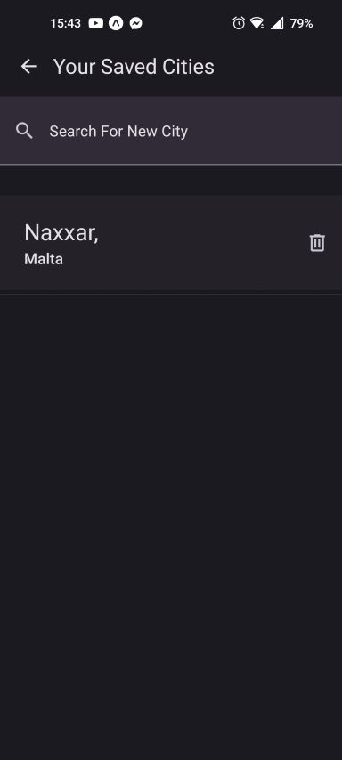
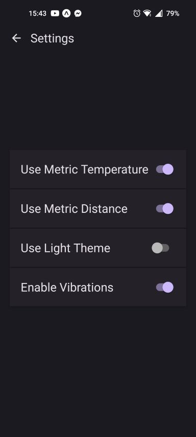

# Weather App

A weather app for Android and IOS. Built using react native and expo.

Upon launching the app, the user is prompted to proivde location access so that the app can automatically provide the forecast for the users location. 

Below is the forecast screen: 

## Cities

The user can add more cities and swipe between them on the homescreen. To add cities, the cities screen has to be opened.

## Settings

The user can access the settings to choose between metric/imperial units, toggle vibrations for notifications and toggle between a light theme and dark theme.

